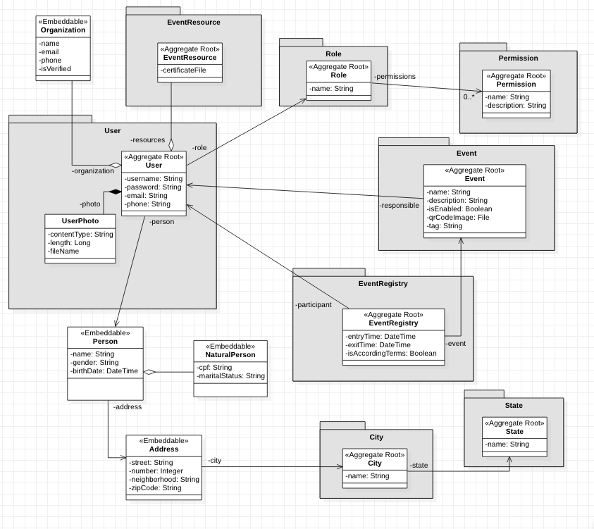

# Eventidge API

Uma aplicação para fazer a ponte entre pessoas e eventos.

- Acredito que para aquela pessoa que busca melhorar seus conhecimentos, participar 
de workshops e diferentes tipos de eventos fica mais simples manter apenas um 
cadastro e rapidamente através de uma tag ou leitura de QR Code participar do evento, 
digamos que um passo a menos para uma landing page.
- A aplicação poderá reunir vários dados dos usuários acerca de inscrições em determinados 
tipos de eventos o que para mim pode justificar determinados tipos de conversão para outros 
eventos no mesmo segmento, que de certo modo o usuário gostaria de participar.

> Esse projeto tem por motivos mostrar tudo aquilo que aprendi e continuo aprendendo para modelar e
implementar REST APIs usando Spring Boot. Nesse projeto vamos utilizar o MySQL e será possível ver
a utilização do JPA e gerenciamento de migrações com o Flyway. Também vamos ver diversos padrões e usos
de boas práticas para implementar uma REST API. Vamos lidar com eventos, envio de emails, armazenamento de arquivos (foto, pdf),
geração de relatórios, Bean Validation, HATEOAS e muito mais. O projeto vai seguir em pleno desenvolvimento e espero conseguir
em breve a primeira release. Estou utilizando a versão 17 do Java e gosto muito de usar bastante das novas
features como lambdas e method references. Então, simbora!

## Features

- [ ] Registro em eventos através de uma tag (ex: #myfirstevent) ou QR Code
- [ ] Gerar relatórios
- [ ] Sorteio com pessoas registradas em um evento

### Diagrama de classes de domínio

## Documentation

No link abaixo você será direcionado para a documentação (em desenvolvimento) utilizando o Postman:
[Documentation](https://documenter.getpostman.com/view/9876543/UVJkBt8N)

## Como contribuir?
Sinta-se à vontade para contribuir com este projeto com um pull request ou issue. Possuo planos
de mais à frente desenvolver o frontend para o consumo dessa API. Este projeto está sob a Apache License 2.0 [LICENSE](LICENSE).

